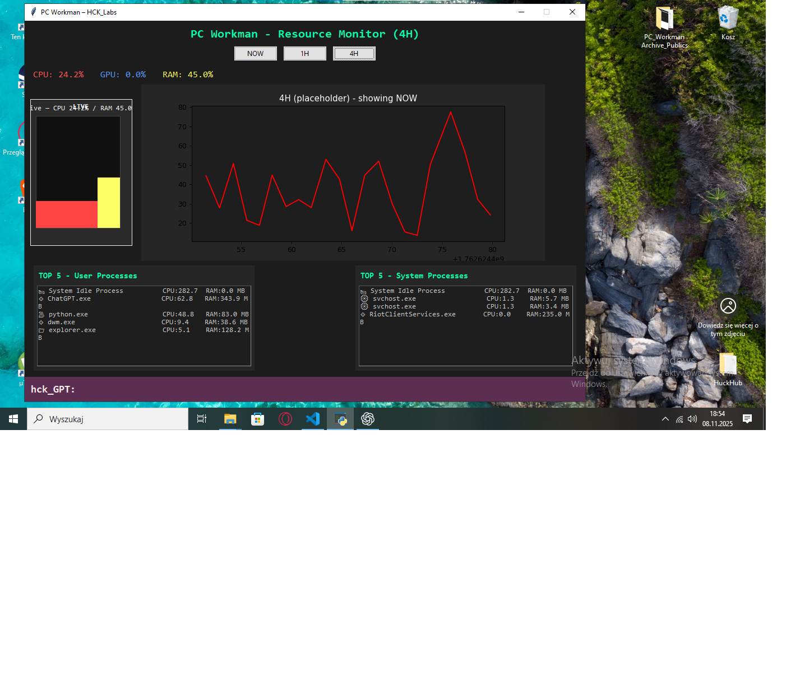

# PC_Workman_HCK  
**Part of [HCK_Labs](https://github.com/HuckleR2003/HCK_Labs)** – modular real-time system monitor and AI-assisted diagnostics framework.  

Version: **1.5.0 (Modern Dashboard & Hardware Monitoring)**
Author: **Marcin Firmuga (HCK_Labs)**
Status: *Active Development – Educational AI Engineering Project*  

---

## Overview  
`PC_Workman_HCK` is a real-time system monitoring tool built in Python.  
It combines **live performance diagnostics**, **data logging**, **AI-assisted analysis**, and a **modular architecture** designed for intelligent system optimization.  

The project is part of the *HCK_Labs* initiative – an educational R&D effort focused on combining AI, system engineering, and cybersecurity practices.  

## Screenshots
Below are early UI prototypes from version 1.0.6:

| Main View | Processes Panel |
|------------|----------------|
|  |  |

---

## What's New in 1.5.0 🚀

### 🎨 Complete Dashboard Redesign
**Modern Minimalist Interface:**
- Apple-inspired flat design with vibrant gradient accents
- Ultra-compact TOP 5 process lists (User & System)
- Side-by-side CPU/RAM indicators with color-coded bars
- Gradient row backgrounds for visual hierarchy
- No emoji clutter - clean, professional appearance
- 40% smaller navigation buttons with horizontal layouts

**Key Improvements:**
- Removed vertically stacked metrics → side-by-side display
- Eliminated Text widgets → Frame-based architecture
- Click-to-show process info (ProcessTooltip integration)
- Consistent color coding: CPU (blue), RAM (yellow), GPU (green)

### 💻 NEW: Your PC - Hardware Health Page
**Real-Time Component Monitoring:**
- Three-column layout: CPU | RAM | GPU
- Live usage percentages with large, readable displays
- Real hardware names via platform/psutil/GPUtil
- Simulated temperature monitoring with dynamic bars
- Intelligent load status classification:
  - 🟢 Bez aktywności (0-30%)
  - 🟡 Standardowa aktywność (30-60%)
  - 🟠 Nadmierne obciążenie (60-85%)
  - 🔴 Nadzwyczajne obciążenie (85%+)

**Component Health Indicators:**
- ⚙️ System status (Normal / Inspection Required)
- 📊 Load analysis with color-coded warnings
- 🌡️ Temperature bars with heat-based coloring
- Ultra-compact 50% smaller panels for maximum info density

### ⚡ NEW: Optimization Options Page
**Windows Services Management:**
- Live active/total services counter
- Quick access to Services Wizard (hck_GPT integration ready)
- One-click "Quick Disable Unnecessary" optimization
- Full rollback support for safety

**Background Process Optimization:**
- 🔇 Disable Telemetry
- 🎮 Gaming Mode Toggle
- ⚙️ Startup Programs Manager
- 🧹 Temp Files Cleanup

### 🎯 Design Philosophy
**Inspired by Industry Leaders:**
- Apple macOS Big Sur/Ventura (flat, minimal, elegant)
- MSI Afterburner (compact, metric-focused)
- Modern dashboards (HWiNFO, CAM, NZXT)

**Core Principles:**
- Maximum information density, minimum visual clutter
- Color-coded everything for instant recognition
- Click-driven interactions (no hover dependencies)
- Readable at small sizes (6-10pt fonts)
- Gradient accents for visual hierarchy

---

## Core Features  

### 🔧 Modular Architecture  
- **Dynamic Component Registry:** automatic module registration via `import_core.py`, assigning unique identifiers (`py001_hck`, `json002_hck`, etc.).  
- **Seamless Interconnection:** all modules communicate through a central `COMPONENTS` registry for efficient data exchange.

### 📊 Core System  
- **Real-time data collection** using `psutil` and `GPUtil`.  
- Continuous **per-second sampling** of CPU, GPU, and RAM usage.  
- Minute-average aggregation and long-term logging (NOW / 1H modes).  
- Persistent logs saved in `/data/logs/` (`raw_usage.csv`, `minute_avg.csv`).  
- Lightweight background scheduler running at 1-second intervals.  

### 💻 User Interface
- Built with **Tkinter + Matplotlib**.  
- Live chart showing CPU, RAM, and GPU utilization.  
- Mode selector: `NOW`, `1H`, `4H` (NOW and 1H active).  
- Live side meter visualizing CPU and RAM usage.  
- Two data tables displaying top resource-heavy processes:  
  - **User processes** (apps, tools, editors, etc.)  
  - **System processes** (Windows core tasks)  
- Basic process labeling and icons (e.g. browsers ⚔️, explorer 📁, games 🎮).  
- Integrated `hck_GPT` assistant panel for system analysis and optimization.

### 🎓 Educational Value  
`PC_Workman_HCK` serves as a technical demonstration of:  
- modular code architecture,  
- GUI–data integration,  
- multithreaded scheduling,  
- AI module integration for offline diagnostic reasoning,
- safe system optimization with rollback capabilities.

---

## Folder Structure  
```
HCK_Labs/PC_Workman_HCK
├────╮	Folder '__pycache__'
│    └── `import_core.cpython-314.pyc`
├────╮	Folder 'ai'
│    ├── `__init__.py`
│    ├── `ai_logic.py`
│    ├── `detector.py`
│    ├── `hck_gpt.py`
│    └──────────────────╮ Folder '__pycache__'
│			            ├── `__init__.cpython-314.pyc` 
│			            ├── `ai_logic.cpython-314.pyc`
│			            ├── `detector.cpython-314.pyc`
│			            ├── `hck_gpt.cpython-314.pyc`
│			            └─╮  `Folder 'model_cache`
|			             └── `__init__.py`
├────╮	Folder 'core'
|    ├── `__init__.py`
|    ├── `analyzer.py`
|    ├── `logger.py`
|    ├── `monitor.py`
|    ├── `scheduler.py`
|    └──────────────────╮ Folder '__pycache__'
│			            ├── `__init__.cpython-314.pyc`
│			            ├── `analyzer.cpython-314.pyc`
│			            ├── `logger.cpython-314.pyc`
│			            ├── `monitor.cpython-314.pyc`
│			            └── `scheduler.cpython-314.pyc`
├────╮	Folder 'data'
│    └──╮  Folder 'cache'
│    	├── `runtime_cache.json`
│    	├── `summary_temp.txt`
│    	└─╮  Folder 'logs'
|   	 ├── `daily_usage.csv`
|	     ├── `hourly_usage.csv`
|	     ├── `minute_avg.csv`
|	     ├── `monthly_usage.csv`
|	     ├── `raw_usage.csv`
|	     ├── `weekly_usage.csv`
|	     └─╮  Folder 'process_info'
|	      ├──  `process_patterns.json`
|	      ├──  `processes_today.json`
|	      └──  `processes_total_average.json`
├────╮	Folder 'docs'
│    ├── `dev-structure.txt`
│    ├── `how_it_works_cross.txt`
│    ├── `screen_v1.png`
│    ├── `screen_v2.png`
|    └── README_PL.md
├────╮	Folder 'hck_stats_engine'
|    ├── `__init__.py`
|    ├── `avg_calculator.py`
|    ├── `time_utils.py`
|    ├── `trend_analysis.py`
|    └──────────────────╮ Folder '__pycache__'    
|		            	├── `__init__.cpython-314.pyc`
|			            ├── `avg_calculator.cpython-314.pyc`
|		            	└── `trend_analysis.cpython-314.pyc`
├────╮	Folder 'settings'
|    ├── `config.json`
|    ├── `paths.json`
|    └── `user_prefs.json`
├────╮	Folder 'tests'
|    ├── `test_analyzer.py`
|    ├── `test_avg_calculator.py`
|    └── `test_monitor.py`
├────╮	Folder 'ui'
│    ├── `charts.py`
│    ├── `dialogs.py`
│    ├── `main_window.py`
│    ├── `theme.py`
│    └──────────────────╮ Folder '__pycache__'
│		            	└── `main_window.cpython-314.pyc`
├────╮	Folder 'utils'
|    ├── `file_utils.py`
|    ├── `net_utils.py`
|    └── `system_info.py`
├──`CHANGELOG.md`
├──`import_core.py`
├──`README.md`
├──`requirements.txt`
├──`setup.py`
└──`startup.py`
```

---

## Installation  

### Requirements  
- Python **3.9+**
- Recommended packages:
```bash
pip install psutil gputil matplotlib
```

### Running
Launch from terminal:
```bash
python startup.py
```

If GUI is available, the live interface will open.

In environments without Tkinter (e.g., servers), the program automatically switches to headless mode, collecting and logging resource data silently.

---

## Roadmap - Updates

| Version    | Status         | Description                                           |
| ---------- | -------------- | ----------------------------------------------------- |
| v1.0.0     | Released       | Basic architecture and mock data prototype            |
| v1.0.4     | Stable         | Early diagnostic demo with simulated data             |
| v1.0.6     | Stable         | Real-time core + first working UI prototype           |
| v1.0.7     | Released       | 4H mode, process patterns, basic `hck_GPT` framework  |
| v1.3.3     | Released       | hck_GPT Service Mode, Easy Boost, UX overhaul         |
| v1.4.0     | Released       | System Tray, Enhanced Process Tracking & Interactive UI |
| **v1.5.0** | **Current**    | **Modern Dashboard, Hardware Monitoring, Apple UI**   |
| v1.5.1     | Planned        | Real temperature sensors (OpenHardwareMonitor)        |
| v1.6.0     | Planned        | hck_GPT ML/AI Mode with usage pattern analysis        |

---

## Author
**Marcin Firmuga (HCK_Labs)**  
*AI & System Engineering – From Factory to AI Engineer*

- **LinkedIn:** [Marcin Firmuga](https://www.linkedin.com/in/marcin-firmuga-a665471a3)
- **GitHub:** [HuckleR2003](https://github.com/HuckleR2003)
- **Email:** firmuga.marcin.s@gmail.com

---

## License
**MIT Educational Open License**  
Non-commercial, attribution required.  
© 2025 HCK_Labs / Marcin Firmuga.